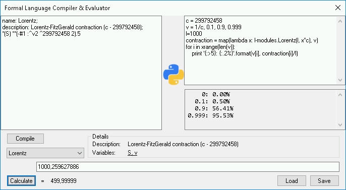
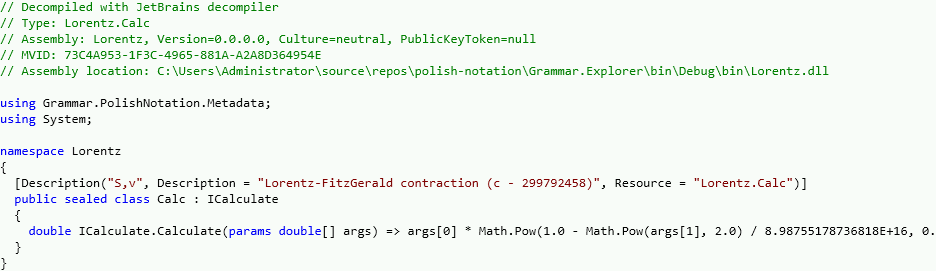

# polish-notation
[ANTLR](https://www.antlr.org)-based (normal) [Polish notation](https://en.wikipedia.org/wiki/Polish_notation) to .NET Framework compiler, with reflection and embedded scripting.
>Please generate ANTLR parser classes prior to building the solution. You can do it with the `G4/01.antlr.bat` script.

  
  

